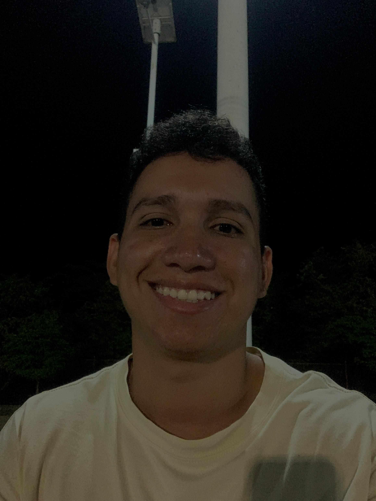

 <h1>Desarrollador Web Full Stack</h1>
  
  <h2>Juan David Carrillo | 21 años</h2>

---

## Sobre mí

¡Hola! Soy Juan David, desarrollador Full Stack apasionado por crear soluciones tecnológicas innovadoras. Tengo experiencia en el desarrollo de aplicaciones web y móviles, utilizando tecnologías modernas tanto en el frontend como en el backend.

## Propósito del portafolio

Este portafolio está diseñado para mostrar mis proyectos, habilidades y experiencia profesional a empresas interesadas en mi perfil. Aquí encontrarás ejemplos de mi trabajo, información sobre mi formación y formas de contactarme.

## Tecnologías principales

- **JavaScript / TypeScript / Php / Java**
- **React / Angular / Astro / Laravel**
- **Node.js / Express / Spring Boot**
- **MongoDB / MySQL / PostgreSQL**
- **HTML / CSS / Tailwind / SASS**

## Tecnologías secundarias

- Bootstrap / linters / prettier / eslint / vite
- Linux (ArchLinux, Ubuntu, Mint)
- Git / npm / pnpm / composer / docker / kubernetes

## Contacto

- Email: anilloj62@gmail.com
- LinkedIn: [linkedin.com/in/juandavid](https://www.linkedin.com/in/juan-david-carrillo-anillo-226747263/)
- Phone Number: +57 3154287827

---

¡Gracias por visitar mi portafolio!
